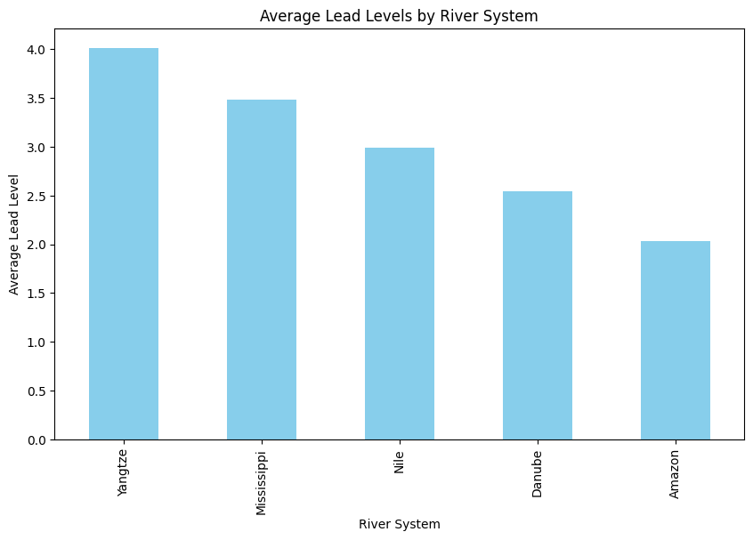
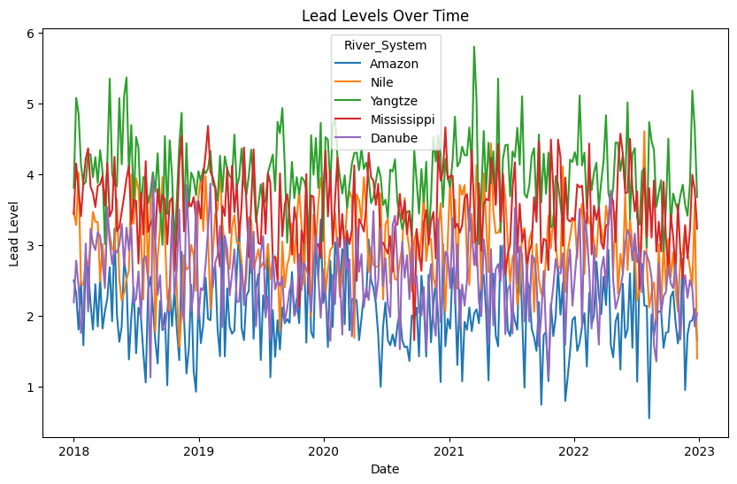
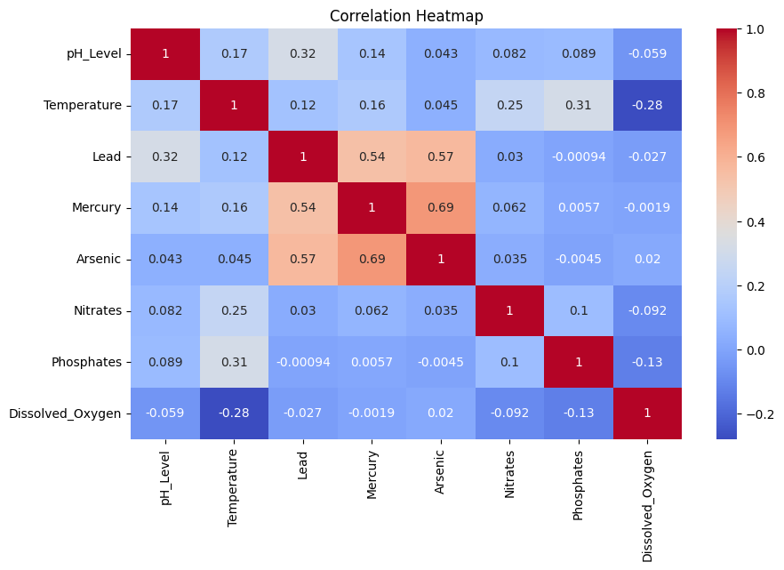
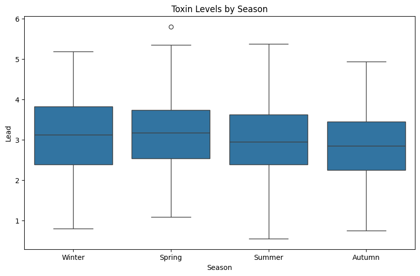

```python
# Import libraries
import pandas as pd
import numpy as np
import matplotlib.pyplot as plt
import seaborn as sns
from scipy import stats
from sklearn.linear_model import LinearRegression

# Set matplotlib to display plots inline
%matplotlib inline
```


```python
#Load the dataset
data = pd.read_csv('C:/Users/ThinkPad/Desktop/Python/Portofolio Projects/IT Online/Project 2 - Environmental Toxin Analysis in River Systems/National_River_Toxin_Dataset_1.csv')

#Display the first few rows
data.head()
```


<div>
<style scoped>
    .dataframe tbody tr th:only-of-type {
        vertical-align: middle;
    }

    .dataframe tbody tr th {
        vertical-align: top;
    }

    .dataframe thead th {
        text-align: right;
    }
</style>
<table border="1" class="dataframe">
  <thead>
    <tr style="text-align: right;">
      <th></th>
      <th>Date</th>
      <th>River_System</th>
      <th>pH_Level</th>
      <th>Temperature</th>
      <th>Lead</th>
      <th>Mercury</th>
      <th>Arsenic</th>
      <th>Nitrates</th>
      <th>Phosphates</th>
      <th>Dissolved_Oxygen</th>
    </tr>
  </thead>
  <tbody>
    <tr>
      <th>0</th>
      <td>2018-01-01</td>
      <td>Amazon</td>
      <td>7.030015</td>
      <td>19.136212</td>
      <td>2.500401</td>
      <td>0.465454</td>
      <td>3.578886</td>
      <td>11.627614</td>
      <td>0.522167</td>
      <td>7.830196</td>
    </tr>
    <tr>
      <th>1</th>
      <td>2018-01-01</td>
      <td>Nile</td>
      <td>7.421766</td>
      <td>21.406824</td>
      <td>3.469443</td>
      <td>0.859716</td>
      <td>5.352155</td>
      <td>10.538171</td>
      <td>0.510465</td>
      <td>8.130328</td>
    </tr>
    <tr>
      <th>2</th>
      <td>2018-01-01</td>
      <td>Yangtze</td>
      <td>7.133612</td>
      <td>18.419902</td>
      <td>3.806935</td>
      <td>0.824085</td>
      <td>5.277814</td>
      <td>7.865033</td>
      <td>0.585096</td>
      <td>8.120874</td>
    </tr>
    <tr>
      <th>3</th>
      <td>2018-01-01</td>
      <td>Mississippi</td>
      <td>7.863001</td>
      <td>18.014871</td>
      <td>3.438131</td>
      <td>0.500597</td>
      <td>3.473881</td>
      <td>11.143068</td>
      <td>0.438248</td>
      <td>6.853816</td>
    </tr>
    <tr>
      <th>4</th>
      <td>2018-01-01</td>
      <td>Danube</td>
      <td>7.527686</td>
      <td>16.622289</td>
      <td>2.188210</td>
      <td>0.424178</td>
      <td>2.454209</td>
      <td>8.043467</td>
      <td>0.422244</td>
      <td>8.197925</td>
    </tr>
  </tbody>
</table>
</div>


```python
# Check the shape
data.shape
```


    (1305, 10)


```python
# Display data info
data.info()
```

    <class 'pandas.core.frame.DataFrame'>
    RangeIndex: 1305 entries, 0 to 1304
    Data columns (total 10 columns):
     #   Column            Non-Null Count  Dtype  
    ---  ------            --------------  -----  
     0   Date              1305 non-null   object 
     1   River_System      1305 non-null   object 
     2   pH_Level          1278 non-null   float64
     3   Temperature       1278 non-null   float64
     4   Lead              1285 non-null   float64
     5   Mercury           1278 non-null   float64
     6   Arsenic           1279 non-null   float64
     7   Nitrates          1265 non-null   float64
     8   Phosphates        1282 non-null   float64
     9   Dissolved_Oxygen  1284 non-null   float64
    dtypes: float64(8), object(2)
    memory usage: 102.1+ KB
    


```python
# Descriptive Statistics
data.describe()
```


<div>
<style scoped>
    .dataframe tbody tr th:only-of-type {
        vertical-align: middle;
    }

    .dataframe tbody tr th {
        vertical-align: top;
    }

    .dataframe thead th {
        text-align: right;
    }
</style>
<table border="1" class="dataframe">
  <thead>
    <tr style="text-align: right;">
      <th></th>
      <th>pH_Level</th>
      <th>Temperature</th>
      <th>Lead</th>
      <th>Mercury</th>
      <th>Arsenic</th>
      <th>Nitrates</th>
      <th>Phosphates</th>
      <th>Dissolved_Oxygen</th>
    </tr>
  </thead>
  <tbody>
    <tr>
      <th>count</th>
      <td>1278.000000</td>
      <td>1278.000000</td>
      <td>1285.000000</td>
      <td>1278.000000</td>
      <td>1279.000000</td>
      <td>1265.000000</td>
      <td>1282.000000</td>
      <td>1284.000000</td>
    </tr>
    <tr>
      <th>mean</th>
      <td>7.353247</td>
      <td>20.041668</td>
      <td>3.011035</td>
      <td>0.596108</td>
      <td>3.597916</td>
      <td>10.038789</td>
      <td>0.497162</td>
      <td>8.023795</td>
    </tr>
    <tr>
      <th>std</th>
      <td>0.349114</td>
      <td>4.063638</td>
      <td>0.874431</td>
      <td>0.175150</td>
      <td>0.992052</td>
      <td>2.096641</td>
      <td>0.106304</td>
      <td>1.064190</td>
    </tr>
    <tr>
      <th>min</th>
      <td>6.465087</td>
      <td>9.891618</td>
      <td>0.551349</td>
      <td>0.157117</td>
      <td>1.485608</td>
      <td>2.025075</td>
      <td>0.144044</td>
      <td>5.041394</td>
    </tr>
    <tr>
      <th>25%</th>
      <td>7.101324</td>
      <td>16.813976</td>
      <td>2.366298</td>
      <td>0.462683</td>
      <td>2.836160</td>
      <td>8.701188</td>
      <td>0.422006</td>
      <td>7.269386</td>
    </tr>
    <tr>
      <th>50%</th>
      <td>7.339326</td>
      <td>20.039121</td>
      <td>3.000714</td>
      <td>0.599186</td>
      <td>3.511678</td>
      <td>10.089112</td>
      <td>0.497631</td>
      <td>8.007448</td>
    </tr>
    <tr>
      <th>75%</th>
      <td>7.585733</td>
      <td>23.358634</td>
      <td>3.676560</td>
      <td>0.734863</td>
      <td>4.298946</td>
      <td>11.391686</td>
      <td>0.572888</td>
      <td>8.740828</td>
    </tr>
    <tr>
      <th>max</th>
      <td>8.392902</td>
      <td>30.749449</td>
      <td>5.800963</td>
      <td>1.057494</td>
      <td>6.232902</td>
      <td>16.547073</td>
      <td>0.870007</td>
      <td>11.228677</td>
    </tr>
  </tbody>
</table>
</div>


```python
# Check for missing values
data.isnull().sum()
```


    Date                 0
    River_System         0
    pH_Level            27
    Temperature         27
    Lead                20
    Mercury             27
    Arsenic             26
    Nitrates            40
    Phosphates          23
    Dissolved_Oxygen    21
    dtype: int64


```python
# Fill missing values in numeric columns
numeric_columns = data.select_dtypes(include=[np.number]).columns
data[numeric_columns] = data[numeric_columns].fillna(data[numeric_columns].mean())
data.isnull().sum()
```


    Date                0
    River_System        0
    pH_Level            0
    Temperature         0
    Lead                0
    Mercury             0
    Arsenic             0
    Nitrates            0
    Phosphates          0
    Dissolved_Oxygen    0
    dtype: int64


```python
# Convert the 'date' column to datatime
data['Date'] = pd.to_datetime(data['Date'])

```


```python
# Calculate the average levels of toxines
average_toxin_levels = data.groupby('River_System')[['Lead', 'Mercury', 'Arsenic']].mean()
print(f'Average Toxin Levels: \n {average_toxin_levels}')

```

    Average Toxin Levels: 
                       Lead   Mercury   Arsenic
    River_System                              
    Amazon        2.030662  0.493555  3.021498
    Danube        2.544912  0.397276  2.517318
    Mississippi   3.478198  0.598506  3.492969
    Nile          2.990203  0.706638  3.987877
    Yangtze       4.011200  0.784567  4.969918
    


```python
#Identify top polluted rivers by average Lead levels
top_polluted_rivers = data.groupby('River_System')['Lead'].mean().sort_values(ascending=False)
print(f'Top Polluted Rivers by Lead Levels: \n {top_polluted_rivers.head(5)}')

```

    Top Polluted Rivers by Lead Levels: 
     River_System
    Yangtze        4.011200
    Mississippi    3.478198
    Nile           2.990203
    Danube         2.544912
    Amazon         2.030662
    Name: Lead, dtype: float64
    


```python
# Bar chart for average Lead Levels per river
plt.figure(figsize=(10,6))
top_polluted_rivers.plot(kind='bar', color='skyblue')
plt.title('Average Lead Levels by River System')
plt.xlabel('River System')
plt.ylabel('Average Lead Level')
plt.show()
```


    

    


```python
# Line graph for toxin Levels over time
plt.figure(figsize=(10,6))
sns.lineplot(x='Date', y='Lead', data=data, hue='River_System', errorbar=None)
plt.title('Lead Levels Over Time')
plt.xlabel('Date')
plt.ylabel('Lead Level')
plt.show()
```


    

    


```python
# Compute the correlation matrix using numeric columns
corr_matrix = data[numeric_columns].corr()
print(corr_matrix)
```

                      pH_Level  Temperature      Lead   Mercury   Arsenic  \
    pH_Level          1.000000     0.167589  0.319700  0.137656  0.042514   
    Temperature       0.167589     1.000000  0.124512  0.160928  0.044863   
    Lead              0.319700     0.124512  1.000000  0.538168  0.566595   
    Mercury           0.137656     0.160928  0.538168  1.000000  0.685925   
    Arsenic           0.042514     0.044863  0.566595  0.685925  1.000000   
    Nitrates          0.082121     0.246166  0.029522  0.062318  0.034924   
    Phosphates        0.089348     0.314542 -0.000937  0.005734 -0.004483   
    Dissolved_Oxygen -0.058682    -0.279058 -0.027448 -0.001926  0.020435   
    
                      Nitrates  Phosphates  Dissolved_Oxygen  
    pH_Level          0.082121    0.089348         -0.058682  
    Temperature       0.246166    0.314542         -0.279058  
    Lead              0.029522   -0.000937         -0.027448  
    Mercury           0.062318    0.005734         -0.001926  
    Arsenic           0.034924   -0.004483          0.020435  
    Nitrates          1.000000    0.099595         -0.092371  
    Phosphates        0.099595    1.000000         -0.125113  
    Dissolved_Oxygen -0.092371   -0.125113          1.000000  
    


```python
# Heatmap for correlation between different parameters
plt.figure(figsize=(10,6))
sns.heatmap(corr_matrix, annot=True, cmap='coolwarm')
plt.title('Correlation Heatmap')
plt.show()

```


    

    


```python
# Create a 'Season' column
data['Month'] = data['Date'].dt.month

# Define seasons
def get_season(month):
    if month in [12, 1, 2]:
        return 'Winter'
    elif month in [3, 4, 5]:
        return 'Spring'
    elif month in [6, 7, 8]:
        return 'Summer'
    else:
        return 'Autumn'

data['Season'] = data['Month'].apply(get_season)
```


```python
# Box plot of toxin levels by season
plt.figure(figsize=(10,6))
sns.boxplot(x='Season', y='Lead', data=data)
plt.title('Toxin Levels by Season')
plt.show()
```


    

    


```python
# T-test between two river system (Amazon and Nile)
amazon_data = data[data['River_System'] == 'Amazon']['Lead']
nile_data = data[data['River_System'] == 'Nile']['Lead']

# Perform the t-test 
t_stat, p_value = stats.ttest_ind(amazon_data, nile_data)

# Display the results
print(f'T-test between Amazon and Nile: T-Statistic = {t_stat}, P-value = {p_value}')

```

    T-test between Amazon and Nile: T-Statistic = -20.23821779031797, P-value = 1.3375120881428664e-67
    


```python
# Linear regression analysis for toxin Levels and pH
x = data[['pH_Level']]
y = data[['Lead']]
model = LinearRegression()
model.fit(x, y)
print(f'Linear Regression Coefficients: {model.coef_}')
print(f'Linear Regression Intercept: {model.intercept_}')

```

    Linear Regression Coefficients: [[0.80294889]]
    Linear Regression Intercept: [-2.89324669]
    


```python

```


```python

```
