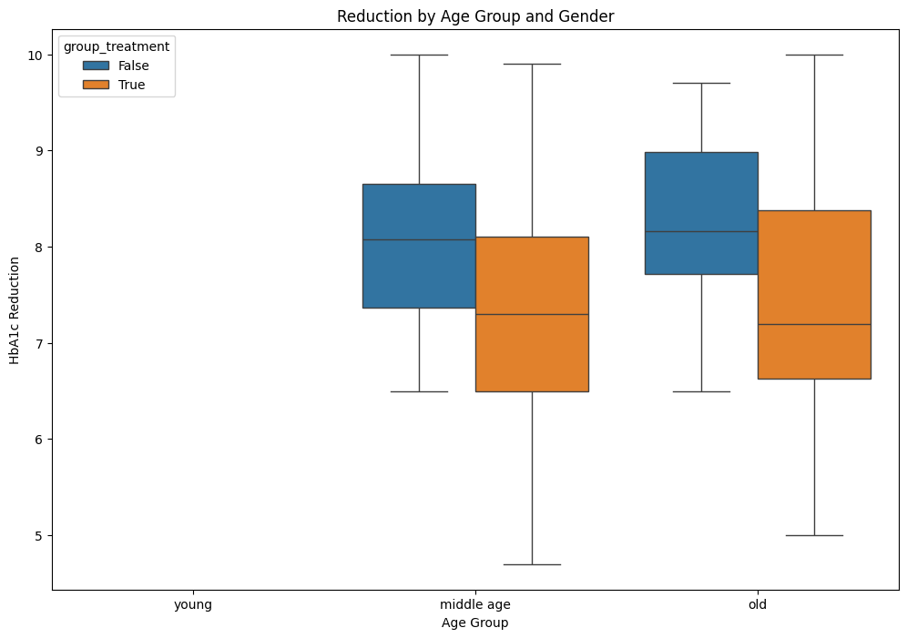

<b>Project 3 Clinical Trial Data Analysis for a New Diabetes Medication</b>


<a href="https://catalinstan88.github.io/">Back</a>


```python
# import required libraries
import pandas as pd
import numpy as np
import matplotlib.pyplot as plt
import seaborn as sns
from scipy import stats
import statsmodels.api as sm
import statsmodels.formula.api as smf

# Set up matplotlib to display plots inline
%matplotlib inline
```


```python
# Load the dataset
df = pd.read_csv('diabetes_medication_clinical_trial1.csv')

# Display the first few rows
df.head()

```


<div>
<style scoped>
    .dataframe tbody tr th:only-of-type {
        vertical-align: middle;
    }

    .dataframe tbody tr th {
        vertical-align: top;
    }

    .dataframe thead th {
        text-align: right;
    }
</style>
<table border="1" class="dataframe">
  <thead>
    <tr style="text-align: right;">
      <th></th>
      <th>subject_id</th>
      <th>group</th>
      <th>age</th>
      <th>gender</th>
      <th>duration_diabetes</th>
      <th>initial_hba1c</th>
      <th>hba1c</th>
      <th>time</th>
      <th>adverse_event</th>
    </tr>
  </thead>
  <tbody>
    <tr>
      <th>0</th>
      <td>1</td>
      <td>treatment</td>
      <td>70</td>
      <td>Female</td>
      <td>10</td>
      <td>8.7</td>
      <td>8.7</td>
      <td>0</td>
      <td>NaN</td>
    </tr>
    <tr>
      <th>1</th>
      <td>2</td>
      <td>placebo</td>
      <td>46</td>
      <td>Male</td>
      <td>19</td>
      <td>9.9</td>
      <td>9.9</td>
      <td>0</td>
      <td>Fatigue</td>
    </tr>
    <tr>
      <th>2</th>
      <td>3</td>
      <td>treatment</td>
      <td>56</td>
      <td>Male</td>
      <td>17</td>
      <td>8.6</td>
      <td>8.6</td>
      <td>0</td>
      <td>NaN</td>
    </tr>
    <tr>
      <th>3</th>
      <td>4</td>
      <td>treatment</td>
      <td>59</td>
      <td>Male</td>
      <td>19</td>
      <td>8.9</td>
      <td>8.9</td>
      <td>0</td>
      <td>Headache</td>
    </tr>
    <tr>
      <th>4</th>
      <td>5</td>
      <td>treatment</td>
      <td>68</td>
      <td>Male</td>
      <td>5</td>
      <td>9.1</td>
      <td>9.1</td>
      <td>0</td>
      <td>NaN</td>
    </tr>
  </tbody>
</table>
</div>


```python
# Data Exploration
# Check the shape of the DataFrame
print(f'DataFrame Shape: {df.shape}')

```

    DataFrame Shape: (1400, 9)
    


```python
# Display info about the DataFrame
df.info()
```

    <class 'pandas.core.frame.DataFrame'>
    RangeIndex: 1400 entries, 0 to 1399
    Data columns (total 9 columns):
     #   Column             Non-Null Count  Dtype  
    ---  ------             --------------  -----  
     0   subject_id         1400 non-null   int64  
     1   group              1400 non-null   object 
     2   age                1400 non-null   int64  
     3   gender             1400 non-null   object 
     4   duration_diabetes  1400 non-null   int64  
     5   initial_hba1c      1400 non-null   float64
     6   hba1c              1400 non-null   float64
     7   time               1400 non-null   int64  
     8   adverse_event      277 non-null    object 
    dtypes: float64(2), int64(4), object(3)
    memory usage: 98.6+ KB
    


```python
# Generate descriptive statistics
df.describe()
```


<div>
<style scoped>
    .dataframe tbody tr th:only-of-type {
        vertical-align: middle;
    }

    .dataframe tbody tr th {
        vertical-align: top;
    }

    .dataframe thead th {
        text-align: right;
    }
</style>
<table border="1" class="dataframe">
  <thead>
    <tr style="text-align: right;">
      <th></th>
      <th>subject_id</th>
      <th>age</th>
      <th>duration_diabetes</th>
      <th>initial_hba1c</th>
      <th>hba1c</th>
      <th>time</th>
    </tr>
  </thead>
  <tbody>
    <tr>
      <th>count</th>
      <td>1400.000000</td>
      <td>1400.000000</td>
      <td>1400.000000</td>
      <td>1400.000000</td>
      <td>1400.000000</td>
      <td>1400.000000</td>
    </tr>
    <tr>
      <th>mean</th>
      <td>100.500000</td>
      <td>55.250000</td>
      <td>10.450000</td>
      <td>8.465500</td>
      <td>7.686029</td>
      <td>12.000000</td>
    </tr>
    <tr>
      <th>std</th>
      <td>57.754936</td>
      <td>9.530602</td>
      <td>5.805306</td>
      <td>0.869367</td>
      <td>1.106412</td>
      <td>8.002859</td>
    </tr>
    <tr>
      <th>min</th>
      <td>1.000000</td>
      <td>40.000000</td>
      <td>1.000000</td>
      <td>7.000000</td>
      <td>4.700000</td>
      <td>0.000000</td>
    </tr>
    <tr>
      <th>25%</th>
      <td>50.750000</td>
      <td>46.000000</td>
      <td>5.000000</td>
      <td>7.700000</td>
      <td>6.980000</td>
      <td>4.000000</td>
    </tr>
    <tr>
      <th>50%</th>
      <td>100.500000</td>
      <td>56.000000</td>
      <td>11.000000</td>
      <td>8.450000</td>
      <td>7.700000</td>
      <td>12.000000</td>
    </tr>
    <tr>
      <th>75%</th>
      <td>150.250000</td>
      <td>64.000000</td>
      <td>16.000000</td>
      <td>9.125000</td>
      <td>8.500000</td>
      <td>20.000000</td>
    </tr>
    <tr>
      <th>max</th>
      <td>200.000000</td>
      <td>70.000000</td>
      <td>20.000000</td>
      <td>10.000000</td>
      <td>10.000000</td>
      <td>24.000000</td>
    </tr>
  </tbody>
</table>
</div>


```python
# Data Cleaning 
#Check for missing values
print(f'Missing Values:\n{df.isnull().sum()}')
```

    Missing Values:
    subject_id              0
    group                   0
    age                     0
    gender                  0
    duration_diabetes       0
    initial_hba1c           0
    hba1c                   0
    time                    0
    adverse_event        1123
    dtype: int64
    


```python
# Handling missing data
df.dropna(inplace=True)
```


```python
# Convert data type
df['time'] = pd.to_numeric(df['time'], errors='coerce')
```


```python
# Convert 'group' to categorical
df['group'] = df['group'].astype('category')

df = pd.get_dummies(df, columns=['group'], drop_first=True)

df.rename(columns={'group_treatment': 'group_treatment'}, inplace=True)

print(df.head())
```

        subject_id  age  gender  duration_diabetes  initial_hba1c  hba1c  time  \
    1            2   46    Male                 19            9.9    9.9     0   
    3            4   59    Male                 19            8.9    8.9     0   
    6            7   69  Female                 12            8.9    8.9     0   
    7            8   44  Female                  1            8.8    8.8     0   
    10          11   52  Female                  2            7.8    7.8     0   
    
       adverse_event  group_treatment  
    1        Fatigue            False  
    3       Headache             True  
    6      Dizziness             True  
    7       Headache             True  
    10        Nausea             True  
    


```python
print(df.columns)
```

    Index(['subject_id', 'age', 'gender', 'duration_diabetes', 'initial_hba1c',
           'hba1c', 'time', 'adverse_event', 'group_treatment'],
          dtype='object')
    


```python
# Convert all columns used in modeling to numeric types
df['group_treatment'] = pd.to_numeric(df['group_treatment'], errors='coerce')

```


```python
# Convert 'hba1c' to numeric
df['hba1c'] = pd.to_numeric(df['hba1c'], errors='coerce')

```


```python
#Calculate average HbA1c levels for treatment and placebo groups
avg_hba1c_treatment = df[df['group_treatment'] == 1]['hba1c'].mean()
avg_hba1c_placebo = df[df['group_treatment'] == 0]['hba1c'].mean()

print(f"Average HbA1c - Treatment Group: {avg_hba1c_treatment}, Placebo Group: {avg_hba1c_placebo}")

```

    Average HbA1c - Treatment Group: 7.35985401459854, Placebo Group: 8.139142857142858
    


```python
# Calculate the change in HbA1c for each subject
df['hba1c_change'] = df.groupby('subject_id')['hba1c'].transform(lambda x: x - x.iloc[0])

print(df.head())
```

        subject_id  age  gender  duration_diabetes  initial_hba1c  hba1c  time  \
    1            2   46    Male                 19            9.9    9.9     0   
    3            4   59    Male                 19            8.9    8.9     0   
    6            7   69  Female                 12            8.9    8.9     0   
    7            8   44  Female                  1            8.8    8.8     0   
    10          11   52  Female                  2            7.8    7.8     0   
    
       adverse_event  group_treatment  hba1c_change  
    1        Fatigue            False           0.0  
    3       Headache             True           0.0  
    6      Dizziness             True           0.0  
    7       Headache             True           0.0  
    10        Nausea             True           0.0  
    


```python
# Count occurences of each type of adverse event
adverse_events = df['adverse_event'].value_counts()

print(adverse_events)

```

    adverse_event
    Fatigue      74
    Nausea       71
    Headache     68
    Dizziness    64
    Name: count, dtype: int64
    


```python
# Data Visualization
# Line plot showing HbA1c levels over time for both groups
plt.figure(figsize=(10, 6))
sns.lineplot(data=df, x='time', y='hba1c', hue='group_treatment')
plt.title('HbA1c Levels Over Time')
plt.xlabel('Time (weeks)')
plt.ylabel('HbA1c Level')
plt.show()
```


    

    


```python
# Box plot comparing final HbA1c levels between groups
plt.figure(figsize=(8, 6))
sns.boxplot(x='group_treatment', y='hba1c', data=df, hue='group_treatment')
plt.title('Final HbA1c Levels Treatment vs Placebo')
plt.xlabel('Group')
plt.ylabel('HbA1c Level')
plt.show()
```


    

    


```python
# Bar chart of the most common adverse events
plt.figure(figsize=(10, 6))
adverse_events.plot(kind='bar')
plt.title('Most Common Adverse Events')
plt.xlabel('Adverse Event')
plt.ylabel('Frequency')
plt.show()
```


    

    


```python
# Scatter plot of initial HbA1c vs change in HbA1c
plt.figure(figsize=(8, 6))
sns.scatterplot(x='initial_hba1c', y='hba1c_change', data=df, hue='group_treatment')
plt.title('Initial HbA1c vs Change in HbA1c')
plt.xlabel('Initial HbA1c Level')
plt.ylabel('Change in HbA1c Level')
plt.show()
```


    

    


```python
# Statistical Analysis
# Perform a t-test to compare final HbA1c levels between treatment and placebo groups
treatment = df[df['group_treatment'] == 1]['hba1c']
placebo = df[df['group_treatment'] == 0]['hba1c']
t_stat, p_value = stats.ttest_ind(treatment, placebo)
print(f"T-statistic: {t_stat}, P-value: {p_value}")
```

    T-statistic: -6.200485372339337, P-value: 2.0550724738165274e-09
    


```python
# Conduct a repeated measure ANOVA to analyse HbA1c changes over time
anova_model = smf.ols('hba1c ~ group_treatment + time', data=df)
anova_results = anova_model.fit()
anova_table = sm.stats.anova_lm(anova_results, typ=2)
print(anova_table)
```

                         sum_sq     df          F        PR(>F)
    group_treatment   43.836941    1.0  50.782549  9.143732e-12
    time              64.254098    1.0  74.434639  5.169343e-16
    Residual         236.524596  274.0        NaN           NaN
    


```python
# Use chi-square test to compare event rates between groups
contingency_table = pd.crosstab(df['group_treatment'], df['adverse_event'])

# Create a contigency table for adverse events by treatment group
chi2, p, dof, expected = stats.chi2_contingency(contingency_table, correction=False)
print(f"Chi-square test result: chi2 = {chi2}, P-value: {p}")
```

    Chi-square test result: chi2 = 3.453364951919518, P-value: 0.32686108897063443
    


```python
# Analyse the medication’s effectiveness based on age groups and gender
df['age_group'] = pd.cut(df['age'], bins=[0, 30, 60, 90], labels=['young', 'middle age', 'old'])

age_gender_analysis = df.pivot_table(values='hba1c', index=['age_group', 'gender'], columns='group_treatment', observed=False)
print(age_gender_analysis)
```

    group_treatment       False     True 
    age_group  gender                    
    middle age Female  8.048718  7.353846
               Male    8.076250  7.360000
    old        Female  8.396552  7.332143
               Male    8.100833  7.442857
    


```python
# Create a box plot for HbA1c by age group and treatment group
plt.figure(figsize=(12, 8))
sns.boxplot(data=df, x='age_group', y='hba1c', hue='group_treatment')
plt.title('Reduction by Age Group and Gender')
plt.xlabel('Age Group')
plt.ylabel('HbA1c Reduction')
plt.show()
```


    

    


```python
# Examine the correlation between duration of diagnosis and HbA1c reduction
correlation = df['duration_diabetes'].corr(df['hba1c_change'])
print(f"Correlation between Duration of Diabetes and HbA1c Reduction: {correlation}")
```

    Correlation between Duration of Diabetes and HbA1c Reduction: -0.010949212625554495
    

<a href="https://catalinstan88.github.io/">Back</a>
